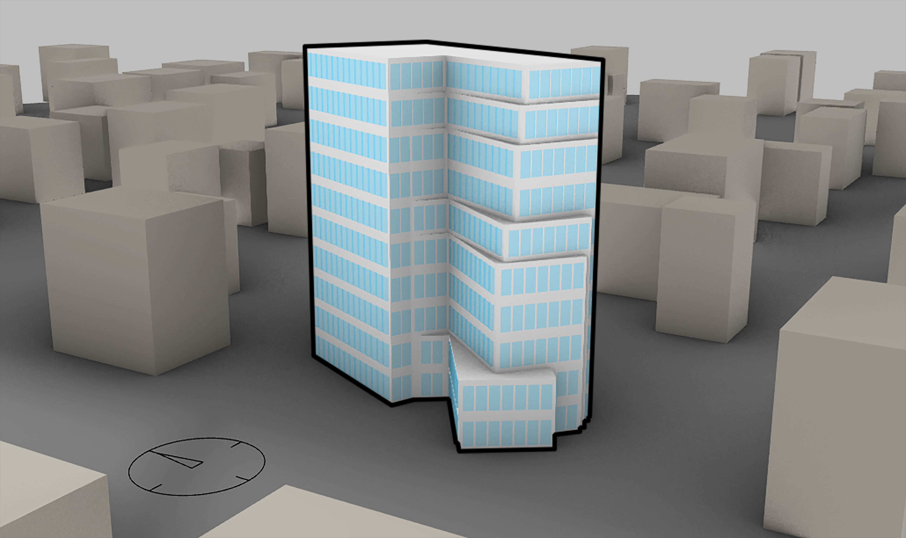
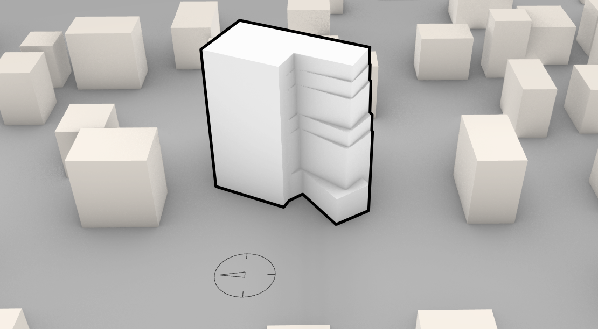
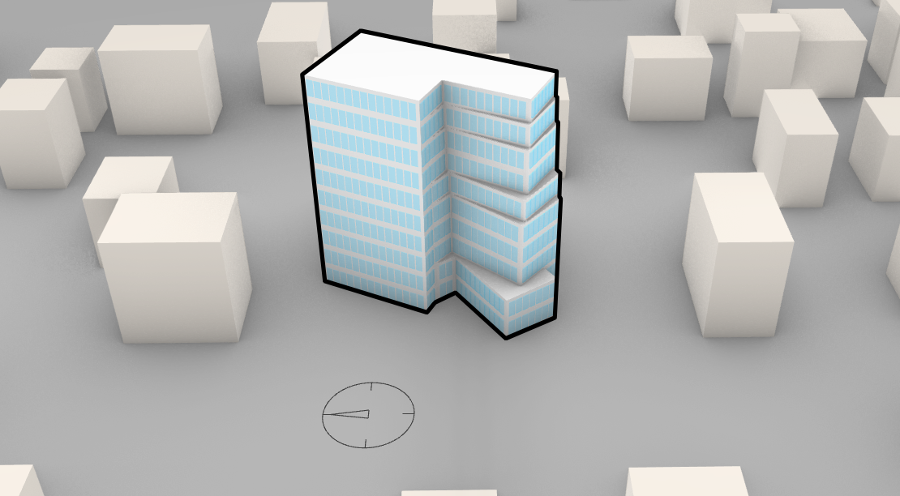

# SolveForm

A Grasshopper plugin for Rhino 8 that generates and evaluates solar-responsive building massing — from a stepped, wind-tuned envelope through facade openings and per-orientation heat performance analysis.

Built in C#, developed as an independent research and portfolio project alongside 3D-printed concrete facade research.



## What it does

**Envelope generation**
- `SectionComponent` — generates a stepped massing envelope per floor, offsetting and rotating slices based on wind-driven boundary-layer physics (Ralph Knowles' Solar Envelope method), with site coverage and max-height constraints.
- `SolveFormUnifyComponent` — booleans the stepped slices into one clean solid envelope, with a normal-flip fallback for boolean edge cases.
- `SolveFormNormalizeComponent` — corrects scrambled face normals after boolean operations via centroid comparison.
- `FloorsComponent` — generates per-floor slab geometry from the massing profiles, zone heights, and slab thickness.

**Facade and openings**
- `OpeningsComponent` — windows each floor's real wall runs. Straight runs get repeated windows at a fixed target width, centered, with any leftover space pushed to the edges rather than squeezing windows to fit. Curved or smooth wall sections become a single continuous ribbon strip instead of being subdivided.
- `Solveformcutopeningscomponent` — boolean-cuts the generated openings into the envelope.

**Performance analysis**
- `Facadeheatanalyzercomponent` — computes solar heat incidence per facade, per compass orientation, using cosine-law incidence against a real baseline (same footprint, same height, no setbacks) rather than a bounding-box approximation, so the comparison is apples-to-apples.
- `Heatorientationchartcomponent` — renders a labeled bar chart comparing the design's solar exposure against the baseline, per orientation.
- `EpwLoaderComponent` — loads weather/climate data from an EPW file to drive the solar and heat calculations.

**Context and site**
- `Contextgeneratorcomponent` — generates a synthetic neighborhood of jittered context masses around the site, respecting site clearance and inter-mass spacing, for grounding renders and (in later versions) informing occlusion-aware analysis.
- `NorthArrowComponent` — places a north arrow indicator for orientation reference in plans and renders.

## Pipeline order

```
EPW File → Site Footprint → Section → Unify → Facade Heat Analyzer → Opening Strips → Cut Openings
Context Generator 
```

## Process

| Site footprint | Massing | Openings | Final |
|---|---|---|---|
|  |  |  |  |

The site footprint is generated within a jittered synthetic context, then extruded and stepped per floor based on wind-driven boundary-layer physics. Facade openings are windowed onto the resulting envelope — straight wall runs get consistent, evenly spaced windows; the notch and setback edges are handled as continuous geometry rather than subdivided.

### Context density range

| Low density | High density |
|---|---|
|  |  |

The Context Generator can produce a range of neighborhood densities around the same site, from sparse to tight-packed, useful for testing the massing logic against different urban conditions.

## Grasshopper definition


## Known limitations

- **Cut Openings** — the current boolean-cut implementation uses a sequential pairwise-union fallback that can silently drop smaller fragments when non-adjacent panels don't touch. A proper multi-cluster accumulator is the scoped fix; not yet implemented.
- **Normalize** and **Facades** components currently have known issues under investigation. Do not rely on their output without manual verification in Rhino.
- Context Generator's occlusion awareness (informing the Facade Heat Analyzer of neighboring building shadow) is not yet wired — context masses are currently visual/grounding only.
- No shading device or dynamic facade response yet — see v0.4 plans below.

## v0.4 plans

- **Context-aware, orientation-responsive facades** — opening size and/or shading response driven by compass orientation and surrounding context, not just floor-level wall geometry.
- **Shading devices** — introduce a shading component layered on top of openings, sized/angled per facade orientation.
- Fix Cut Openings via multi-cluster accumulator.
- Fix Normalize and Facades components.

  
## Installation

1. Download the latest `.gha` from [Releases](../../releases).
2. Copy it into your Grasshopper Components folder (`%appdata%\Grasshopper\Libraries` on Windows).
3. Restart Rhino/Grasshopper. Components appear under the **SolveForm** tab.

Requires Rhino 8.

## Status

Actively developed. Current version: v0.3.

## Author

Menatallah Abdulrhman— architect and computational designer. [GitHub](https://github.com/Menatallah90)
